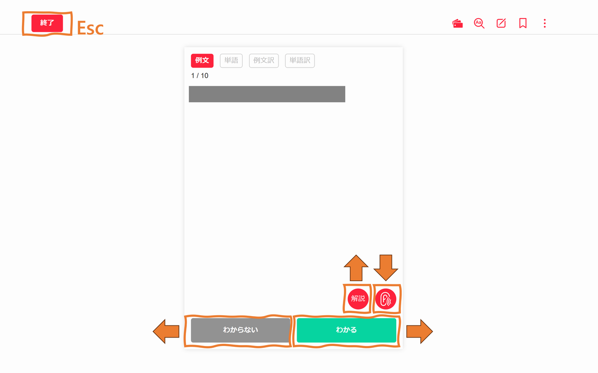

# Abceed Shortcut Key

Abceedをキーボードで操作できるようにするChrome拡張機能です。
初期版として金のフレーズに対応を確認。

## 機能

矢印キーで以下の操作ができます。

### 学習セクション選択画面
* **↑**：前のセクションへ
* **↓**：次のセクションへ
* **←**：左のボタン
* **→**：右のボタン

### 問題画面
* **←**：わからない
* **→**：わかる
* **↑**：解説
* **↓**：音声再生

### 問題終了画面
* **→**：次へ

### 結果画面
* **←**：もう一度
* **→**：次へ
* **↑**：確認テスト（確認テスト自体は未対応）

## インストール方法

1. **ファイルのダウンロード**
   * 画面右上の緑色の「Code」ボタンをクリック
   * 「Download ZIP」をクリック
   * ダウンロードしたZIPファイルを展開（解凍）

2. **Chromeに拡張機能を追加**
   * Chromeを開く
   * アドレスバーに `chrome://extensions/` と入力してEnterキーを押す
   * 右上の「デベロッパーモード」をクリック（オンにする）
   * 左上の「パッケージ化されていない拡張機能を読み込む」をクリック
   * 展開したフォルダを選択

3. **動作確認**
   * Abceedを開く
   * 学習ページに移動
   * 矢印キーを押して操作できることを確認

## 注意事項

* この拡張機能は個人利用を目的として作成されています
* Abceedのアップデートにより動作しなくなる可能性があります
* 問題がある場合はIssuesでご報告ください

## アンインストール方法

1. Chromeを開く
2. アドレスバーに `chrome://extensions/` と入力
3. この拡張機能の「削除」をクリック

## ライセンス

MIT License
